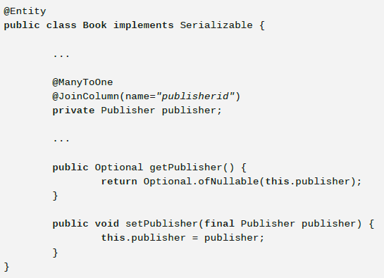
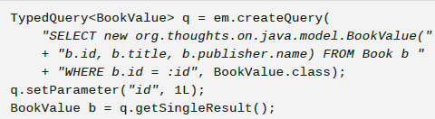

## Hibernate

### 1. Unidirectional/Bidirectional associations 

- TYPES - @OneToMany, @ManyToOne, @ManyToMany
- NAVIGATION - bidirectional in both sides, so access to associations without explicit queries is possible
- REMOVAL CHILDREN - Unidirectional are NOT efficient when comes to removing child entities. Bidirectional (@OneToMany) is much more efficient because the child entity controls the association 
- JOIN_COLUMN - @JoinColumn - if you want different column
- FETCH TYPES - eager, lazy

### 2. Many to many

`@Entity
public class Store {
    @ManyToMany
    @JoinTable(name = “store_product”,
           joinColumns = { @JoinColumn(name = “fk_store”) },
           inverseJoinColumns = { @JoinColumn(name = “fk_product”) })
    private Set<Product> products = new HashSet<Product>();
}`

### 3. EntityManager -> Session

There is 'unwrap' method

`Session session = em.unwrap(Session.class);`

`SessionFactory sessionFactory = em.getEntityManagerFactory()
.unwrap(SessionFactory.class);`

### 4. @Column

`@Column(name = "created_at", updatable = false) `

`private LocalDateTime createdAt;`

`@Column(name = "updated_at", insertable = false)`

`private LocalDateTime updatedAt;`

- updatable
- insertable
- nullable

### 5. Dates

- java.util.Date and java.util.Calendar are always mapped to SQL TIMESTAMP with nanoseconds
- @Temporal - @Temporal(TemporalType.DATE) private Date date

### 6. Enums

- @Enumerated(EnumType.ORDINAL) and @Enumerated(EnumType.STRING)
- Ordinal = default
- AttributeConverter - to define own mapping

### 7. ID Generation type

- AUTO - base on the types (numerical or UUID), persistence provider decides here, hibernate decides by dialect and for most DBs it is sequence
- IDENTITY - rely on database, auto-incremented, disables batch updates,
- SEQUENCE - switches to table generation id database does not support it. 
- TABLE - uses database table that holds segments of identifier generation values. It selects creating lock and updates sequence in order to next insert a record. That is not efficient comparing sequence or identity options.

Almost all modern databases support sequences or auto-incremented columns that generate
primary key values more efficiently than the table strategy described in this tip.

### 8. @Immutable

- update not on entity allowed

### 9. Converter 

`@Converter(autoApply = true)`

`public class AuthorStatusConverter implements AttributeConverter<AuthorStatus, String>`

### 10. Generation time 

`@Column`

`@Generated(GenerationTime.ALWAYS)`

`private LocalDateTime lastUpdate;`

### 11. @Formula

`@Column private LocalDate dateOfBirth;`

`@Formula(value = "date_part('year', age(dateOfBirth))") private int age;`

- downside - Hibernate executes it evry time data is fetched from the DB.

### 12. @Transient

- ignoring in reading and writing the enrity

### 13.@PrePersist and @PreRemove

- before save the method annotated by @PrePersist is will be executed

### 13. @OrderBy

- order in which associated enities shall be retrieved 
- @OrderBy(value = "lastName ASC")

### 14. Many-to-many

- midle table entity
- @Embeddable

### 15. Inheritance

- @MappedSuperclass - mapping from superclass, not from @Entity
- @Inheritance(strategy = InheritanceType.TABLE_PER_CLASS)
- @Inheritance(strategy = InheritanceType.JOINED)
- @Inheritance(strategy = InheritanceType.SINGLE_TABLE), @DiscriminatorColumn on subclass

### 16. Optional 

### 17. Logging

`<property name="hibernate.format_sql" value="true" />`

`<property name="hibernate.generate_statistics" value="true" />`

`<property name="hibernate.use_sql_comments" value="true" />`

### 18. Typed query

### 19. JOIN FETCH

- can initialize lazy relations and prevents LazyInitializationException outside transaction
- @NamedEntityGraph and join fetch can prevent n+1 issue

### 20. JPQL functions 

- upper(s)
- lower(s)
- current_date()
- current_time()
- current_timestamp()
- substring()
- trim()
- length()
- abs()
- sqrt()
- mod()
- size()

### 21. Pagination - by offset and limit only

- setMaxResults
- serFirstResult

### 22. Deleting

- by query - DELETE FROM exampleTable

### 23. Native query

- @NamedNativeQuery

### 24. Cache

- shared-cache-mode - NONE, ENABLE_SELECTIVE, DISABLE_SELECTIVE, ALL
- @Cacheable and @Cache(hibernate)
- Hibernate does not use the second-level cache with JPQL and CriteriaQuery

### 25. FetchTypes

- FetchTypes.Lazy - default in to-many
- FetchTypes.Eager - default in to-one

### 26. N+1

- SELECT FROM Order o JOIN FETCH o.items i - join fetch 
- entityGraph

### 27. Native query 

- em.createNativeQuery
- paramter queries - no sql injections, automate type mapping, allows addtional optimization
- positional parameters available. but named parameters not
- @SqlResultSetMappings - mapping sql results on the entity
- mapping 

### 28. Logging

 - org.hibernate - all
 - org.hibernate.stat - statistics
 - org.hibernate.cache - 2nd level cache
 - org.hibernate.SQL - executed SQLs, debug for dev and error for prod,
 - org.hibernate.type.descriptor.sql - bind parameters values

### 29. EM -> SF

- Session session = em.unwrap(Session.class)
- SessionFactory = em.getEntityManagerFactory.unwrap(SessionFactory.class)

### 30. Tips 

- do not use unidirectional one-to-many associations
- CascadeType.Remove - to many removals, use orphanRemoval, removal in bulk
- FetchType.LAZY for @ManyToOne
- MultipleBagFetchException  - when you are trying to fetch many bag in one query 
- @ManyToMany - use set, not list
- ZonedDateTime - supported from 5, hibernate.jdbc.time.zone on UTC
- @EitherOr

